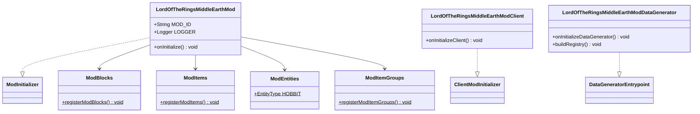
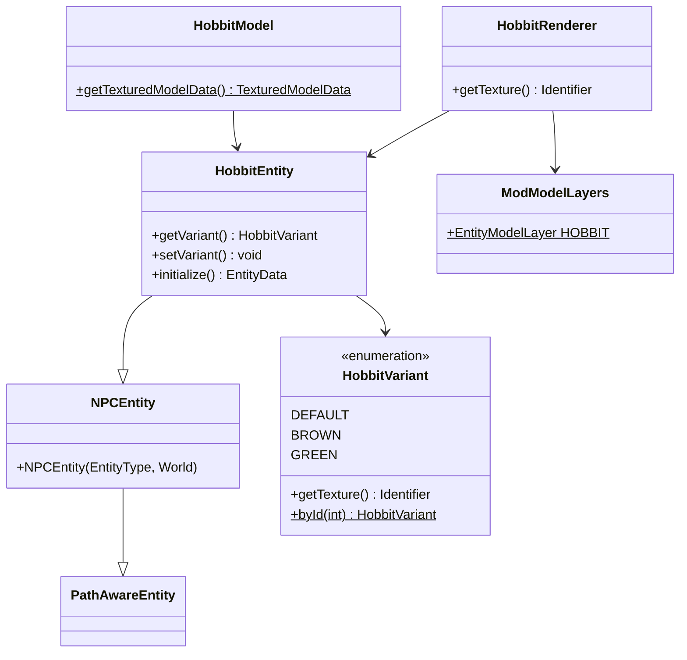
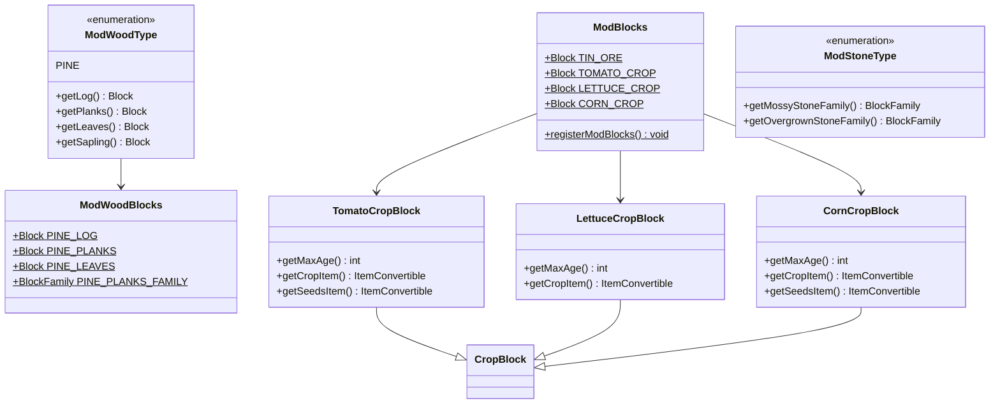
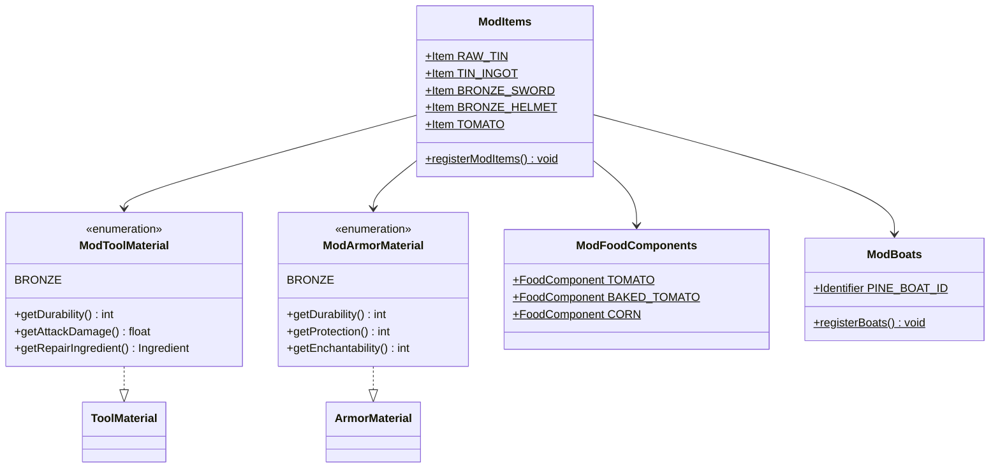
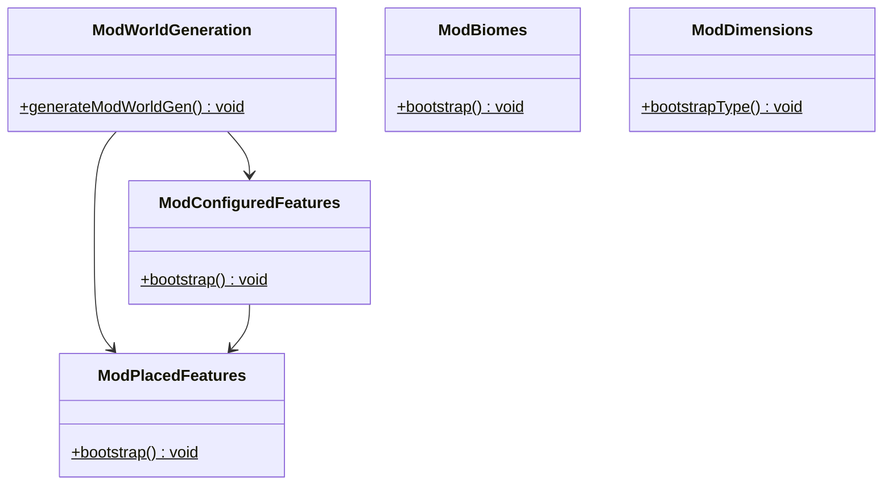
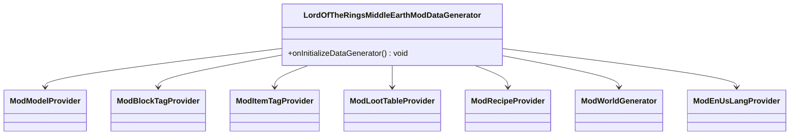

# Lord of the Rings Middle Earth Mod - Class Diagrams

This document contains Mermaid class diagrams showing the structure and relationships of the main classes in the Lord of the Rings Middle Earth Mod. The diagrams are organized by functional areas for better readability.

## 1. Main Mod Structure Overview

## 2. Entity System

## 3. Block System

## 4. Item System & Materials

## 5. World Generation

## 6. Data Generation System

## Package Overview

### Main Package (`me.anedhel.lotr`)
Contains the three main entry points for the mod:
- **LordOfTheRingsMiddleEarthMod**: Server-side mod initialization
- **LordOfTheRingsMiddleEarthModClient**: Client-side initialization  
- **LordOfTheRingsMiddleEarthModDataGenerator**: Data generation setup

### Block Package (`me.anedhel.lotr.block`)
Handles all block-related functionality including:
- Block registration and definitions
- Wood type system with various wood blocks
- Stone type system with variants
- Custom crop blocks for farming

### Item Package (`me.anedhel.lotr.item`)
Manages all items in the mod:
- Item registration
- Tool and armor materials
- Food components
- Item groups for creative inventory

### Entity Package (`me.anedhel.lotr.entity`)
Contains entity-related classes:
- Custom entities like HobbitEntity
- Entity variants and models
- Boats system
- Client-side rendering

### World Package (`me.anedhel.lotr.world`)
Handles world generation features:
- Configured features for terrain
- Placed features for world decoration
- Custom biomes
- Dimension definitions

### Data Generation Package (`me.anedhel.lotr.datagen`)
Provides data generation for:
- Block and item models
- Recipes and loot tables
- Language files
- Tags for blocks and items

## Key Design Patterns

1. **Registry Pattern**: Used throughout for registering blocks, items, and entities
2. **Enum Pattern**: Used for materials (ModToolMaterial, ModArmorMaterial) and variants
3. **Builder Pattern**: Used in entity attribute creation and world generation
4. **Template Pattern**: Used in data generation providers
5. **Factory Pattern**: Used in item and block creation

## Architecture Notes

- The mod follows Fabric's modular architecture with clear separation between client and server code
- Uses dependency injection through Fabric's API system
- Implements proper resource management through registries
- Follows Minecraft's existing patterns for blocks, items, and entities
- Includes comprehensive data generation for assets and data